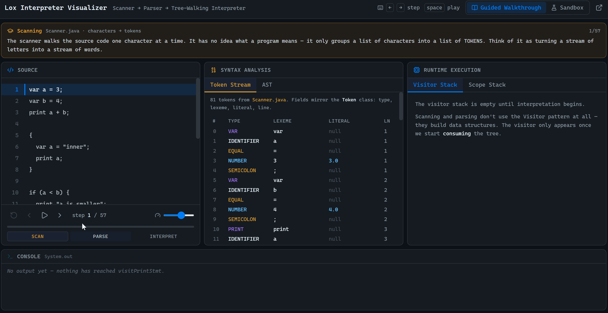

# Lox Interpreter & Execution Visualizer

An interactive visualizer for a Java-based **Lox interpreter**. This tool is intended for users reading Robert Nystrom's *Crafting Interpreters* (chapters 1-9) or anyone interested in visualizing core interpreter processes.

The application captures real-time state from the Lox interpreter, including lexical tokens, AST nodes, visitor call stacks, and environment scope chains and streams them to an interactive frontend. 

**Try it Live:** [https://lox-interpreter.vercel.app](https://lox-interpreter.vercel.app)



---

## Key Features

* **Interactive Stepper:** Forward, backward, pause, and step-by-step program execution tracking.
* **Dual Execution Modes:**
  * **Guided Walkthrough:** Pre-written Lox program, offline execution trace with step-by-step commentary.
  * **Sandbox Mode:** Custom Lox code editor with real-time execution via the live Java backend.
* **Rich State Inspection:** Live panels for AST tree visualization, token streams, visitor call stacks, and environment scope chains.

---

## Architecture & Tech Stack

* **Backend:** Java 17 (`com.sun.net.httpserver`), Docker, Render
* **Frontend:** React 19, Vite 8, Tailwind CSS v4, Lucide Icons, Vercel

```text
lox-interpreter/
├── src/                                    # Java Lox Interpreter & Trace Engine
│   └── com/craftinginterpreters/lox/
│       ├── TraceServer.java                # Lightweight HTTP Server
│       ├── TraceExporter.java              # State capture hook & probe
│       └── Json.java                       # Zero-dependency JSON serializer
├── frontend/                               # React + Vite Visualizer UI
├── Dockerfile                              # Container configuration for Render
└── README.md
```

---

## Running Locally

### 1. Backend (Java)
``` Bash
javac -encoding UTF-8 -d bin src/com/craftinginterpreters/lox/*.java
java -cp bin com.craftinginterpreters.lox.TraceServer
```

### 2. Frontend (React)
``` Bash
cd frontend
npm install
npm run dev
```
---

## Keyboard Shortcuts

| Key | Action |
|---|---|
| `→` / `j` | Step forward |
| `←` / `k` | Step back |
| `Space` | Play / Pause |

